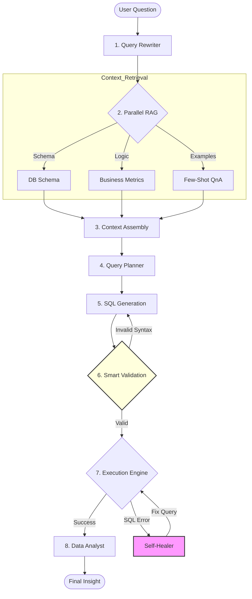

# Sqlwise AI Agent 🤖🛒

**An Advanced "Reflect-and-Heal" (RAH) SQL Agent for E-Commerce Analytics**

## 📖 Project Brief

**Sqlwise AI Agent** is an intelligent, autonomous data analyst designed to bridge the gap between complex e-commerce databases and non-technical business users. Built on a sophisticated **Reflect-and-Heal (RAH)** architecture, it allows users to ask natural language questions about their e-commerce data (orders, products, revenue, customer behavior) and receive accurate, data-backed insights.

Unlike simple text-to-SQL tools, this agent doesn't just write queries; it **plans, validates, executes, debugs, and analyzes** them. It mimics the cognitive process of a senior data analyst, ensuring high reliability even when facing ambiguous questions or schema complexities.

## 🎯 What Problem Does It Solve?

In traditional e-commerce analytics, business stakeholders face significant friction:
1.  **Dependency on Data Teams:** "Simple" questions often sit in backlog queues for days.
2.  **SQL Complexity:** E-commerce schemas (Orders, OrderItems, Refund, Sessions) are complex, making ad-hoc analysis difficult.
3.  **Fragility of GenAI:** Standard LLMs often hallucinate table names or write syntactically incorrect SQL that fails.

**Sqlwise AI Agent solves this by:**
*   Empowering business users to get **instant answers**.
*   Handling complex joins and metrics (e.g., "Net Revenue week-wise excluding refunds") automatically.
*   **Self-healing:** If a generated query fails, the agent understands the error and fixes itself without user intervention.

---

## 🔄 The "Reflect-and-Heal" Workflow

The agent follows a rigorous 8-step pipeline to ensure accuracy.

### Workflow Diagram

### Detailed Pipeline Steps:
1.  **Rewrite User Query:** Converts ambiguous inputs (e.g., "sales last month") into precise, explicit questions.
2.  **Retrieve Context (Parallel RAG):** simultaneously fetches:
    *   Relevant Database Schema (tables/columns).
    *   Business Logic (e.g., definition of "Net Revenue").
    *   Similar past Q&A examples for few-shot learning.
3.  **Context Assembly:** Combines retrieved knowledge into a unified context window.
4.  **Create SQL Plan:** Uses "SQL-of-Thought" to breakdown the problem (Joins, Filters, Aggregations) *before* writing code.
5.  **Generate SQL Query:** Writes the SQL query based on the plan and context.
6.  **Smart Validation:** A strict validation agent checks for syntax errors, prohibited DML operations, and schema hallucinations.
7.  **Execute & Heal:**
    *   Runs the query against the MSSQL database.
    *   **Self-Healing:** If the query fails (e.g., "Invalid column name"), the **Self-Healer** agent analyzes the error, looks at the schema, and corrects the query automatically. It retries up to 3 times.
8.  **Analyze Results:** A specialized Data Analyst agent interprets the raw data rows and provides a business-friendly summary and actionable insights.

---

## 🏗️ Architecture

The system is built with a modular, agentic architecture:

*   **Language Model:** OpenAI GPT-4o / GPT-4o-mini (via LangChain)
*   **Vector Store:** Qdrant (for RAG context)
*   **Embeddings:** Cohere (embed-v4.0)
*   **Database:** Microsoft SQL Server (MSSQL)
*   **Orchestration:** Python Generators (for streaming status updates)
*   **Validation:** Pydantic & SQLParsers

### Key Agents
| Agent | Role |
| :--- | :--- |
| **Query Rewriter** | Clarifies intent and temporal references. |
| **Query Planner** | Decomposes complex questions into logical steps. |
| **SQL Agent** | The core coder that writes T-SQL. |
| **Query Validator** | Static analysis to catch syntax incorrectness early. |
| **Self-Healer** | Runtime debugger that fixes execution errors. |
| **Data Analyst** | Storyteller that turns rows into insights. |

---

## 🆚 Comparison with Traditional Systems

| Feature | 📊 Traditional BI / Dashboards | 🤖 Standard Text-to-SQL | 🚀 Sqlwise AI Agent (RAH) |
| :--- | :--- | :--- | :--- |
| **Flexibility** | Low (Pre-defined views) | Medium (Limited by training) | **High (Ad-hoc queries)** |
| **Reliability** | High (Hardcoded) | Low (Prone to hallucinations) | **High (Self-Validating)** |
| **Complexity Handling** | High (Built by engineers) | Low (Fails on joins/literals) | **High (Planner + RAG)** |
| **Error Handling** | N/A | Fails with "Error" message | **Auto-Fixes (Healing)** |
| **Setup Time** | Weeks/Months | Minutes | **Hours (Schema Indexing)** |

---

## 🔮 Future Roadmap & Scaling

To scale this project from a prototype to a production-grade enterprise solution:

### 1. Robust API Layer (FastAPI)
*   Transition from `cli.py` to a full `FastAPI` backend (already planned in `src/main.py`).
*   Support asynchronous request handling for high concurrency.

### 2. Advanced Caching Strategy
*   Implement **Semantic Caching** (Redis/Vectara) to serve instant answers for repeated or similar queries, bypassing the expensive LLM/SQL generation loop.

### 3. Containerization & Orchestration
*   Fully containerize the application using **Docker** (Dockerfile included).
*   Deploy via **Kubernetes (K8s)** for auto-scaling agents based on load.

### 4. Multi-Tenancy & Security
*   Implement Row-Level Security (RLS) within the SQL generation to ensure users only access data they are authorized to see.
*   Tenant-aware RAG retrieval.

### 5. Frontend Dashboard
*   Develop a React/Next.js frontend to visualize the "Thinking Process" and render charts (Bar/Line/Pie) from the Data Analyst's output.
